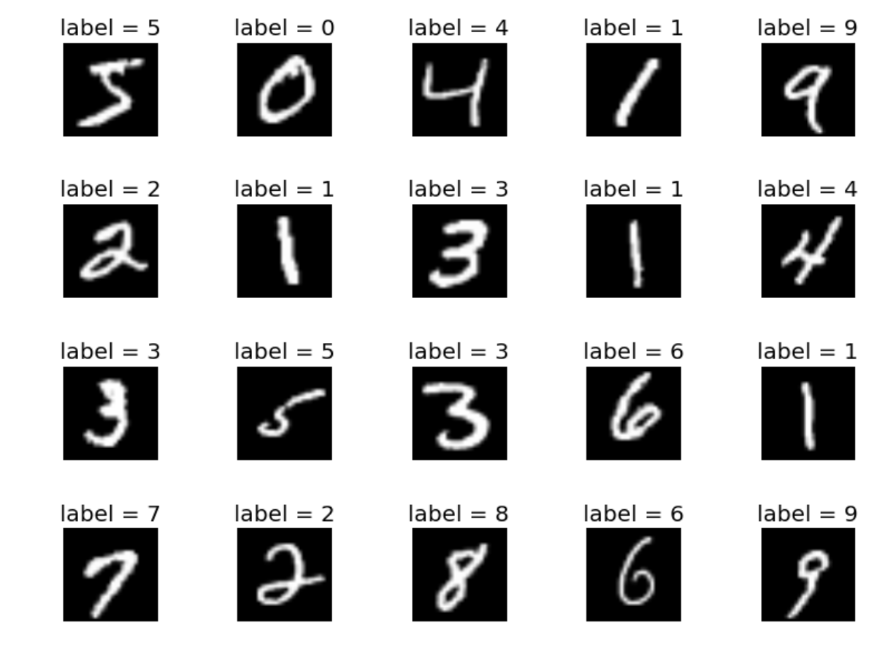
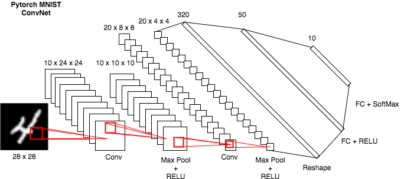

# Basic MNIST Example



This project implements a beginner classification task on [MNIST](http://yann.lecun.com/exdb/mnist/) dataset with a [Convolutional Neural Network(CNN or ConvNet)](https://en.wikipedia.org/wiki/Convolutional_neural_network) model. This is a porting of [pytorch/examples/mnist](https://github.com/pytorch/examples/tree/master/mnist) making it usables on [FloydHub](https://www.floydhub.com/).

## Usage

Training/Evaluating script:

```bash
usage: main.py [-h] [--dataroot DATAROOT] [--evalf EVALF] [--outf OUTF]
               [--ckpf CKPF] [--batch-size N] [--test-batch-size N]
               [--epochs N] [--lr LR] [--momentum M] [--no-cuda] [--seed S]
               [--log-interval N] [--train] [--evaluate]

PyTorch MNIST Example

optional arguments:
  -h, --help           show this help message and exit
  --dataroot DATAROOT  path to dataset
  --evalf EVALF        path to evaluate sample
  --outf OUTF          folder to output images and model checkpoints
  --ckpf CKPF          path to model checkpoint file (to continue training)
  --batch-size N       input batch size for training (default: 64)
  --test-batch-size N  input batch size for testing (default: 1000)
  --epochs N           number of epochs to train (default: 10)
  --lr LR              learning rate (default: 0.01)
  --momentum M         SGD momentum (default: 0.5)
  --no-cuda            disables CUDA training
  --seed S             random seed (default: 1)
  --log-interval N     how many batches to wait before logging training status
  --train              training a ConvNet model on MNIST dataset
  --evaluate           evaluate a [pre]trained model
```

If you want to use more GPUs set `CUDA_VISIBLE_DEVICES` as bash variable then run your script:

```bash
# CUDA_VISIBLE_DEVICES=2 python main.py  # to specify GPU id to ex. 2
```

## MNIST CNN Architecture



## Run on FloydHub

Here's the commands to training, evaluating and serving your MNIST ConvNet model on [FloydHub](ttps://www.floydhub.com/).

### Project Setup

Before you start, log in on FloydHub with the [floyd login](http://docs.floydhub.com/commands/login/) command, then fork and init
the project:

```bash
$ git clone https://github.com/ReDeiPirati/mnist.git
$ cd mnist
$ floyd init mnist
```

### Training

This project will automatically dowload and process the [MNIST](http://yann.lecun.com/exdb/mnist/) dataset for you, moreover I have already [uploaded it as FloydHub dataset](https://www.floydhub.com/redeipirati/datasets/pytorch-mnist) so that you can try and familiarize with `--data` parameter which mount the specified volume(datasets/model) inside the container of your FloydHub instance.

Now it's time to run our training on FloydHub. In this example we will train the model for 10 epochs with a gpu instance and with cuda enabled.
**Note**: If you want to mount/create a dataset look at the [docs](http://docs.floydhub.com/guides/basics/create_new/#create-a-new-dataset).

```bash
$ floyd run --gpu --env pytorch-0.2:py2  --data redeipirati/datasets/pytorch-mnist/1:input "python main.py --train"
```

Note:
- `--gpu` run your job on a FloydHub GPU instance
- `--env pytorch-0.2:py2` prepares a pytorch environment for python 2.
- `--data redeipirati/datasets/pytorch-mnist/1` mounts the pytorch mnist dataset in the /input folder inside the container for our job so that we do not need to dowload it at training time.


You can follow along the progress by using the [logs](http://docs.floydhub.com/commands/logs/) command.
The training should take about 2 minutes on a GPU instance and about 15 minutes on a CPU one.

### Evaluating

It's time to evaluate our model with some images:

```bash
floyd run --gpu --env pytorch-0.2:py2 --data <REPLACE_WITH_JOB_OUTPUT_NAME>:/model "python main.py --evaluate --ckpf /model/<REPLACE_WITH_MODEL_CHECKPOINT_PATH> --evalf ./test"
```

Notes:

- I've prepared for you some images in the `test` folder that you can use to evaluate your model. Feel free to add on it a bunch of handwritten images download from the web or created by you.
- Remember to evaluate images which are taken from a similar distribution, otherwise you will have bad performance due to distribution mismatch.

### Try our pre-trained model

We have provided to you a pre-trained model trained for 10 epochs with an accuracy of 98%.

```bash
floyd run --gpu --env pytorch-0.2:py2  --data redeipirati/datasets/pytorch-mnist-10-epochs-model/1:/model "python main.py --evaluate --ckpf /model/mnist_convnet_model_epoch_10.pth --evalf ./test"
```

### Serve model through REST API

FloydHub supports seving mode for demo and testing purpose. Before serving your model through REST API,
you need to create a `floyd_requirements.txt` and declare the flask requirement in it. If you run a job
with `--mode serve` flag, FloydHub will run the `app.py` file in your project
and attach it to a dynamic service endpoint:

```bash
floyd run --gpu --mode serve --env pytorch-0.2:py2  --data <REPLACE_WITH_JOB_OUTPUT_NAME>:input
```

The above command will print out a service endpoint for this job in your terminal console.

The service endpoint will take a couple minutes to become ready. Once it's up, you can interact with the model by sending an handwritten image file with a POST request that the model will classify:
```bash
# Template
# curl -X POST -F "file=@<HANDWRITTEN_IMAGE>" -F "ckp=<MODEL_CHECKPOINT>" <SERVICE_ENDPOINT>

# e.g. of a POST req
curl -X POST -F "file=@./test/images/1.png" https://www.floydhub.com/expose/BhZCFAKom6Z8RptVKskHZW
```

Any job running in serving mode will stay up until it reaches maximum runtime. So
once you are done testing, **remember to shutdown the job!**

*Note that this feature is in preview mode and is not production ready yet*

## More resources

Some useful resources on MNIST and ConvNet:

- [MNIST](http://yann.lecun.com/exdb/mnist/)
- [Colah's blog](https://colah.github.io/posts/2014-10-Visualizing-MNIST/)
- [FloydHub Building your first ConvNet](https://blog.floydhub.com/building-your-first-convnet/)
- [How Convolutional Neural Networks work - Brandon Rohrer](https://youtu.be/FmpDIaiMIeA)
- [An Intuitive Explanation of Convolutional Neural Networks](https://ujjwalkarn.me/2016/08/11/intuitive-explanation-convnets/)
- [Stanford CS231n](https://cs231n.github.io/convolutional-networks/)
- [Stanford CS231n Winter 2016 - Karpathy](https://youtu.be/NfnWJUyUJYU)

## Contributing

For any questions, bug(even typos) and/or features requests do not hesitate to contact me or open an issue!
